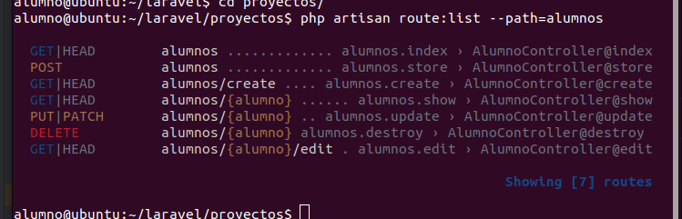

# Creando crud para alumnos

## Primero creo todo el ecosistema

```bash
php artisan make:model alumno -a
```

## Creo el factory, migration, seeder, model, controller, resource y policy

* **factory** crea valores para un registro de una tabla de bases de datos
* **migration** me crea una tabla en la base de datos con los campos que le diga
* **seeder** es para insertar datos creados con el factory dentro de la tabla
* **model** Es una clase que interactúa con una tabla la base de datos
* **controller** es para manejar solicitudes y administrar las respuestas de la aplicación
* **request** para validar los datos del formulario
* **policy** (pendiente de ver y de usar ....) es para definir reglas de autorización para los recursos, incluyendo el
  modelo, las vistas y las actions

## Creo la base de datos para acceder a las tablas

> definir base datos en .env

```bash 
docker compose up -d
```

## levantar el vite y el artisan

> el vite

```bash
npm run dev
```

> el artisan en background con '&'

```bash
php artisan serve &
```

## creo la tabla y la pueblo

> Ejectuo con artisan una comando para ejecutar las migraciones (crear las tablas en la base de datos) y también los
> seeder para realizar la población en la tabla

````bash
php artisan migrate:fresh --seed
````

> El parámetro **fresh** lo que hace es borrar todas las tablas si estuvieran

## establecer el fichero routes (web.php)

> poner el routes en el web

```bash
Route::resource("alumnos", AlumnoController::class);
```

> Comprobar las rutas (--path es para definir la uri específica)

```bash
php artisan route:list --path=alumnos
``` 



## implemento método dni

````bash
 private function dni()
    {
        $letras="TRWAGMYFPDXBNJZSQVHLCKE";
        $num_dni=fake()->randomNumber("8",true);
            info("numero $num_dni");
        $letra=$letras[$num_dni%23];
        return "$num_dni-$letra";
    }
````

## comprobar rutas en el nav para los botones

> resources/views/components/layout/nav.blade.php

````bash
 <a href="alumnos" class="btn ">Alumnos</a>
<a href="profesores" class="btn ">Profesores</a>
````

## Creación, modificación y visualización de alumnos


## Listado (Visualización)

Para esta acción va a ocurrir esta relación solicitud-acción

GET alumnos => AlumnoController@index
> comprobar el método index en el controlador

```bash
 public function index()
    {
        $alumnos= Alumno::all();
        return view("alumnos.listado", compact("alumnos"));
    }
```
>El enlace para mostrar el listado
```bash
 <a href="{{route('alumnos.create')}}">
            <button type="button" class="btn btn-primary items-center ">Nuevo alumno</button>
</a>
```
>creación de tabla con todos los elementos de la tabla
```bash
 <th>Nombre</th>
<th>Email</th>
<th>Direccion</th>
<th>DNI</th>
```
> recorrer la variable creada en el index del controlador 
```bash
> @foreach($alumnos as $alumno)
```
